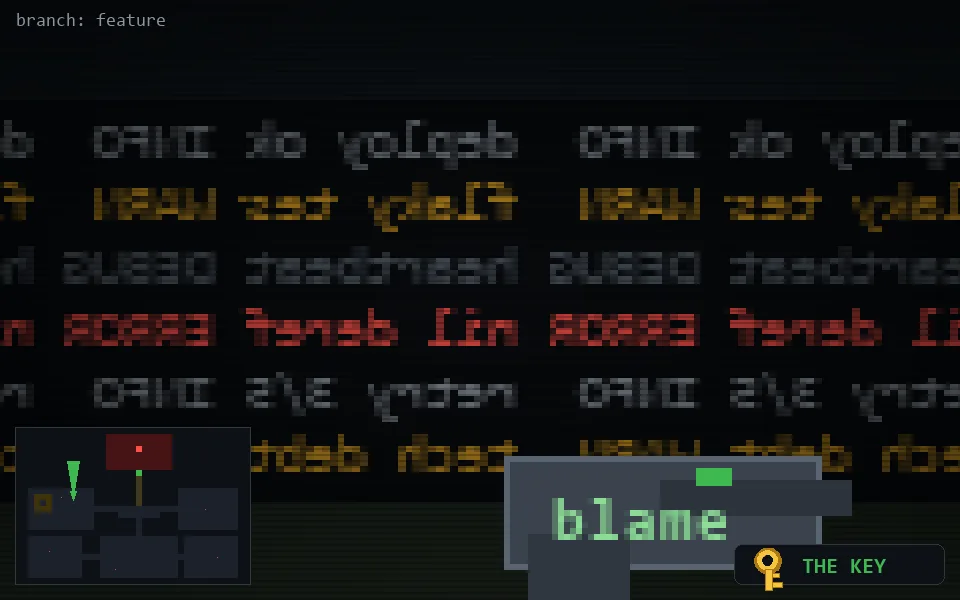

<!-- node:x09y11Nk -->
### `branch: feature` · 📍 (9, 11) · facing N · 🔑 THE KEY

|      |      |      |
|:----:|:----:|:----:|
|      | [⬆️](x09y10Nk.md) |      |
| [⬅️](x09y11Wk.md) | [💥](x09y11Nkd.md) | [➡️](x09y11Ek.md) |
|      | [⬇️](x09y12Nk.md) |      |

[⌂ index](../README.md)
