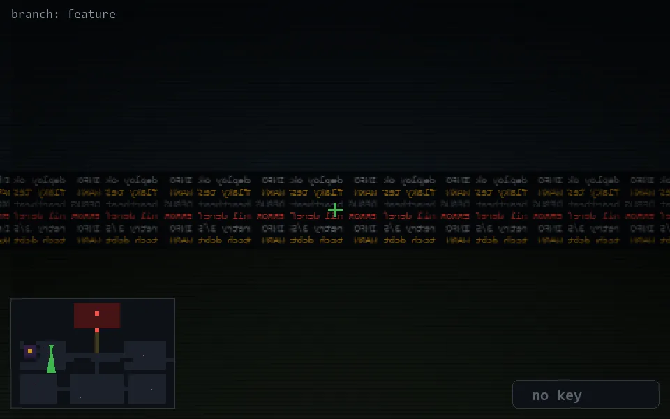

<!-- node:x09y11S -->
### `branch: feature` · 📍 (9, 11) · facing S · 🔑 —

|      |      |      |
|:----:|:----:|:----:|
|      | [⬆️](x09y12S.md) |      |
| [⬅️](x09y11E.md) | [💥](x09y11S.md) | [➡️](x09y11W.md) |
|      | [⬇️](x09y10S.md) |      |

[⌂ index](../README.md)
