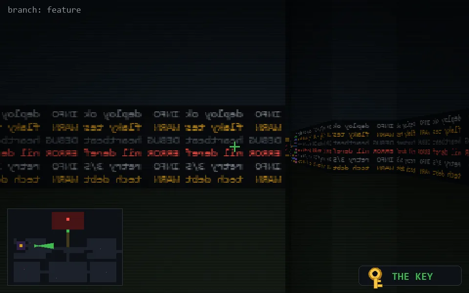

<!-- node:x09y12Ek -->
### `branch: feature` · 📍 (9, 12) · facing E · 🔑 THE KEY

|      |      |      |
|:----:|:----:|:----:|
|      | [⬆️](x10y12Ek.md) |      |
| [⬅️](x09y12Nk.md) | [💥](x09y12Ek.md) | [➡️](x09y12Sk.md) |
|      | [⬇️](x08y12Ek.md) |      |

[⌂ index](../README.md)
