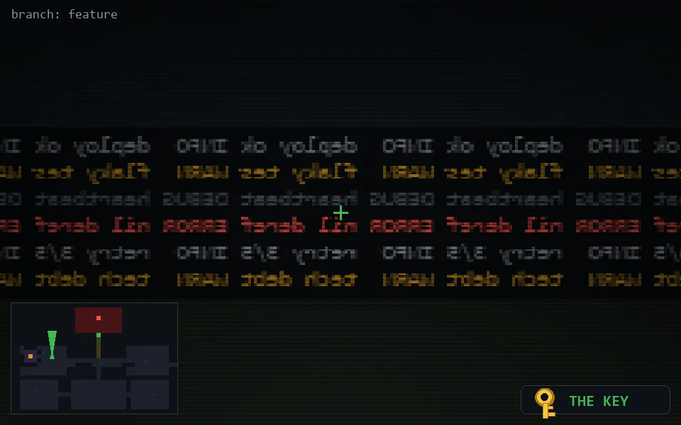

<!-- node:x09y12Nk -->
### `branch: feature` · 📍 (9, 12) · facing N · 🔑 LGTM

|      |      |      |
|:----:|:----:|:----:|
|      | [⬆️](x09y11Nk.md) |      |
| [⬅️](x09y12Wk.md) | [💥](x09y12Nk.md) | [➡️](x09y12Ek.md) |
|      | [⬇️](x09y13Nk.md) |      |

[⌂ index](../README.md)
