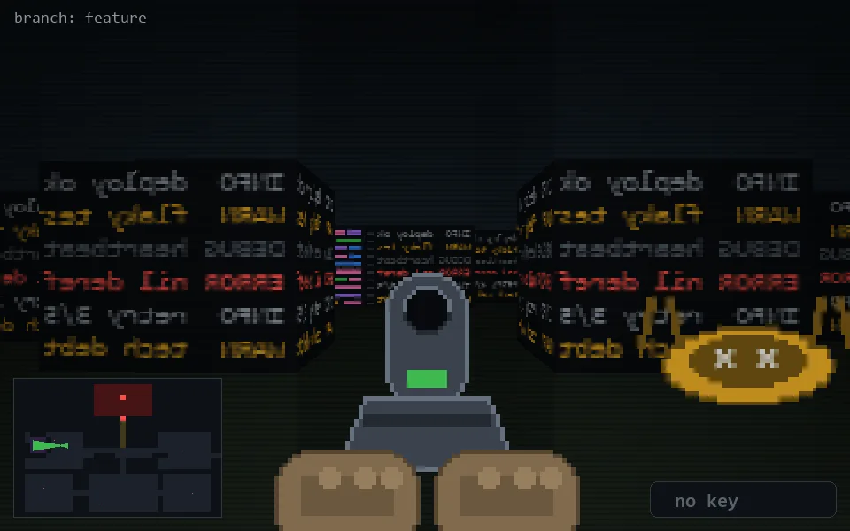

<!-- node:x09y12Wd -->
### `branch: feature` · 📍 (9, 12) · facing W · 🔑 — · ✖ bug deleted (it will be back)

|      |      |      |
|:----:|:----:|:----:|
|      | [⬆️](x08y12Wd.md) |      |
| [⬅️](x09y12Sd.md) | [💥](x09y12Wd.md) | [➡️](x09y12Nd.md) |
|      | [⬇️](x10y12Wd.md) |      |

[⌂ index](../README.md)
