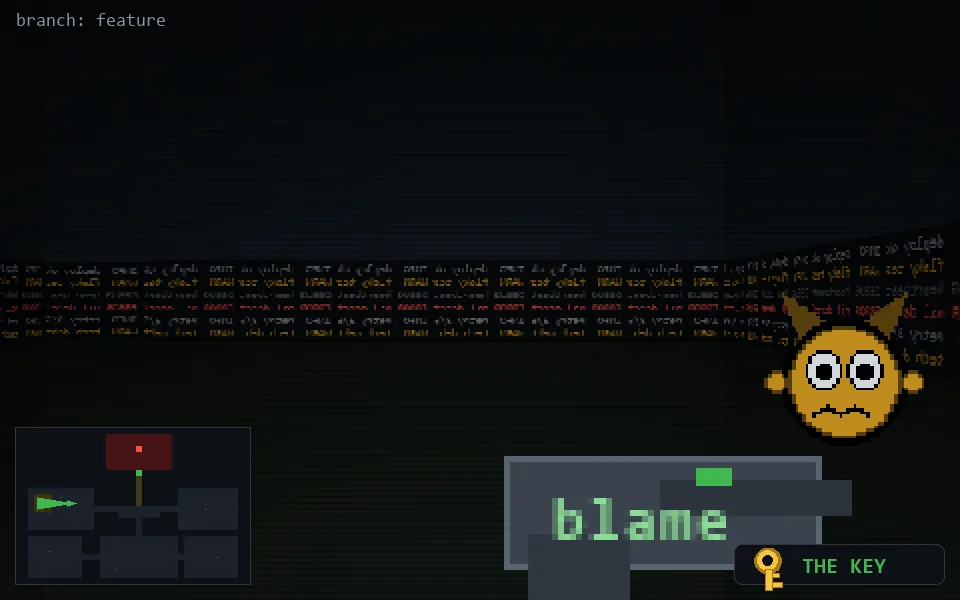

<!-- node:x09y12Wk -->
### `branch: feature` · 📍 (9, 12) · facing W · 🔑 THE KEY

|      |      |      |
|:----:|:----:|:----:|
|      | [⬆️](x08y12Wk.md) |      |
| [⬅️](x09y12Sk.md) | [💥](x09y12Wk.md) | [➡️](x09y12Nk.md) |
|      | [⬇️](x10y12Wk.md) |      |

[⌂ index](../README.md)
