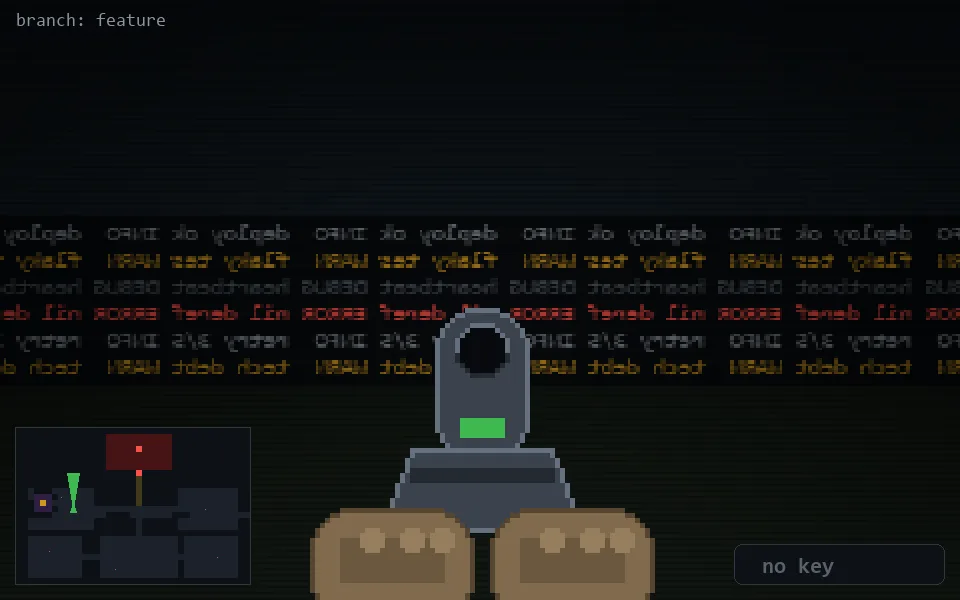

<!-- node:x09y13Nd -->
### `branch: feature` · 📍 (9, 13) · facing N · 🔑 — · ✖ bug deleted (it will be back)

|      |      |      |
|:----:|:----:|:----:|
|      | [⬆️](x09y12Nd.md) |      |
| [⬅️](x09y13Wd.md) | [💥](x09y13Nd.md) | [➡️](x09y13Ed.md) |
|      | [⬇️](x09y14Nd.md) |      |

[⌂ index](../README.md)
