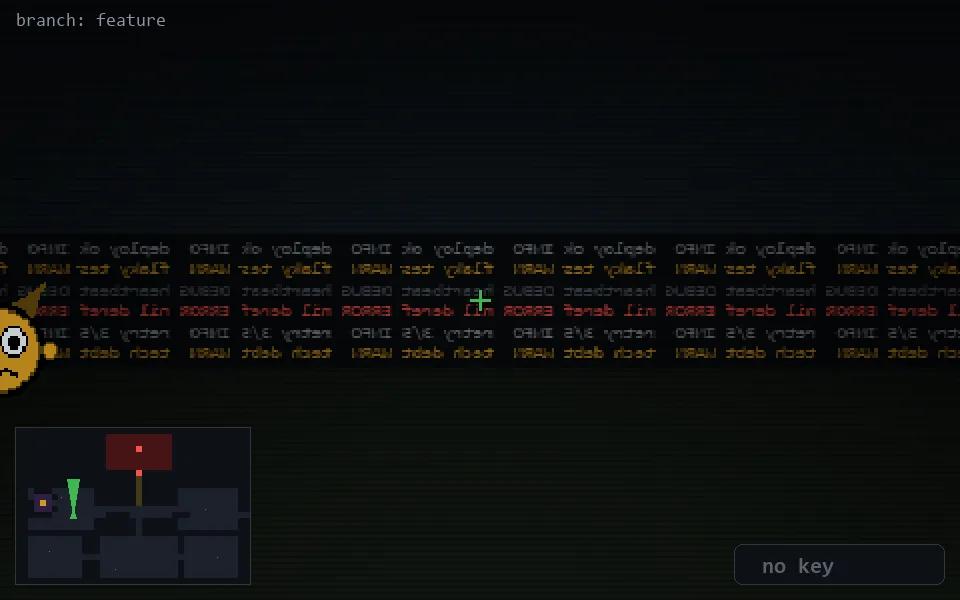

<!-- node:x09y14N -->
### `branch: feature` · 📍 (9, 14) · facing N · 🔑 —

|      |      |      |
|:----:|:----:|:----:|
|      | [⬆️](x09y13N.md) |      |
| [⬅️](x09y14W.md) | [💥](x09y14Nd.md) | [➡️](x09y14E.md) |
|      | [⬇️](x09y15N.md) |      |

[⌂ index](../README.md)
