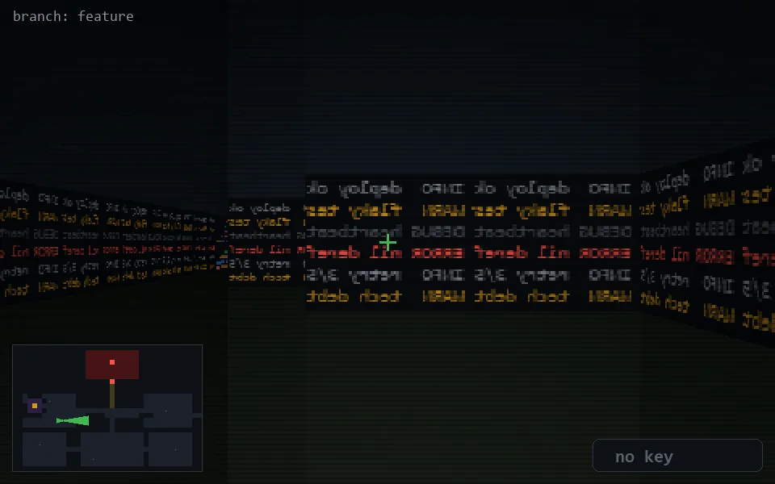

<!-- node:x09y15E -->
### `branch: feature` · 📍 (9, 15) · facing E · 🔑 —

|      |      |      |
|:----:|:----:|:----:|
|      | [⬆️](x10y15E.md) |      |
| [⬅️](x09y15N.md) | [💥](x09y15Ed.md) | [➡️](x09y15S.md) |
|      | [⬇️](x08y15E.md) |      |

[⌂ index](../README.md)
