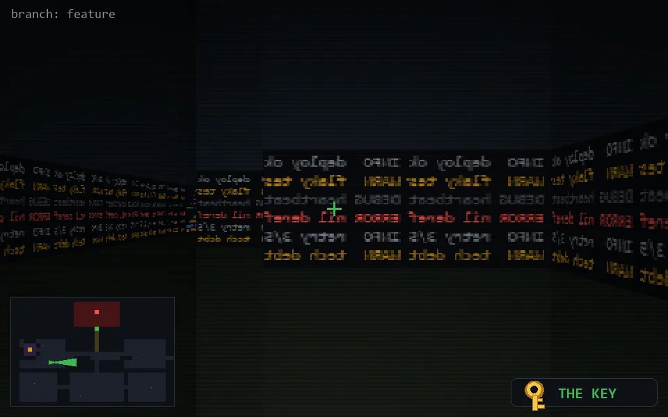

<!-- node:x09y15Ek -->
### `branch: feature` · 📍 (9, 15) · facing E · 🔑 LGTM

|      |      |      |
|:----:|:----:|:----:|
|      | [⬆️](x10y15Ek.md) |      |
| [⬅️](x09y15Nk.md) | [💥](x09y15Ek.md) | [➡️](x09y15Sk.md) |
|      | [⬇️](x08y15Ek.md) |      |

[⌂ index](../README.md)
