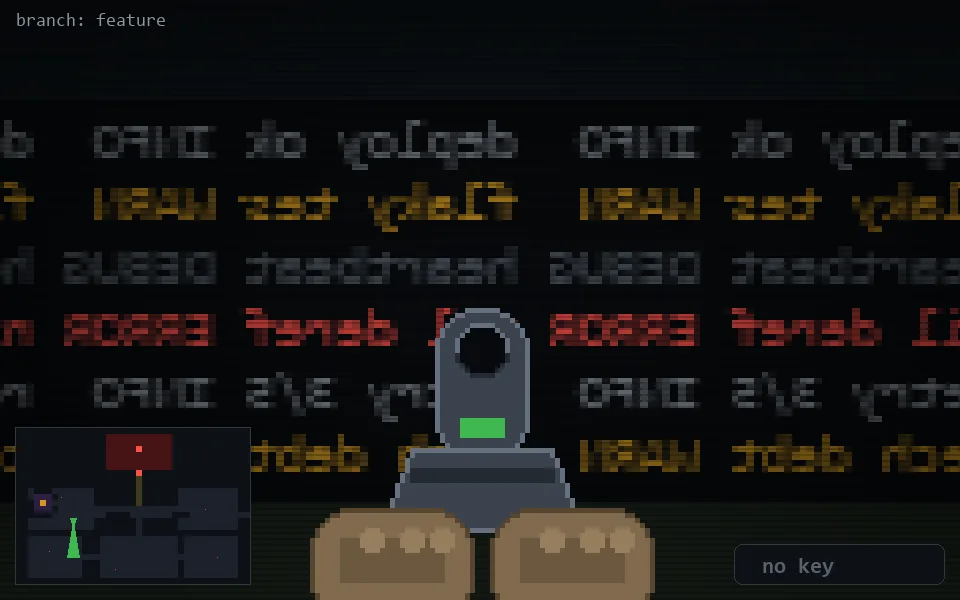

<!-- node:x09y15Sd -->
### `branch: feature` · 📍 (9, 15) · facing S · 🔑 — · ✖ bug deleted (it will be back)

|      |      |      |
|:----:|:----:|:----:|
|      | [⬆️](x09y16Sd.md) |      |
| [⬅️](x09y15Ed.md) | [💥](x09y15Sd.md) | [➡️](x09y15Wd.md) |
|      | [⬇️](x09y14Sd.md) |      |

[⌂ index](../README.md)
