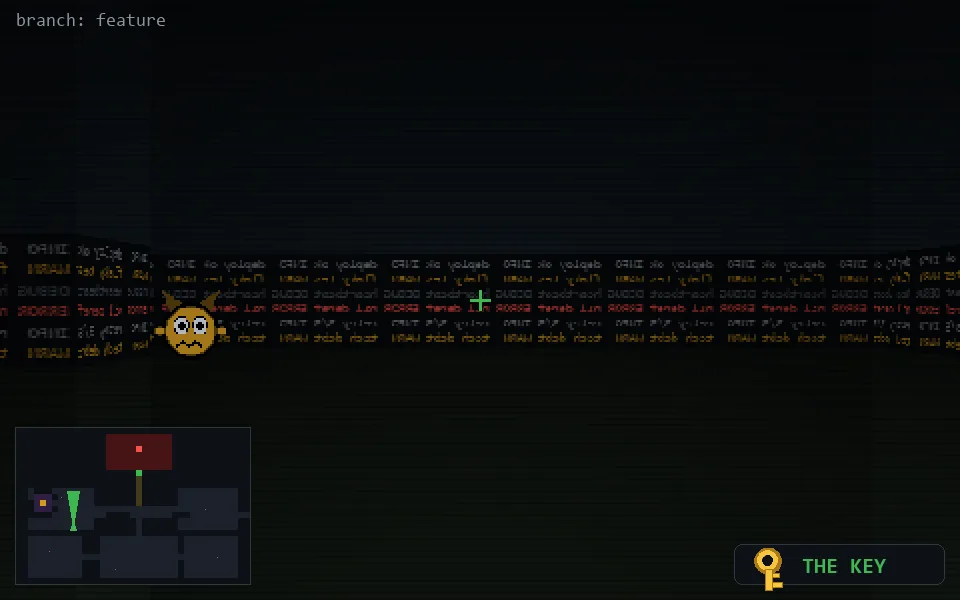

<!-- node:x09y16Nk -->
### `branch: feature` · 📍 (9, 16) · facing N · 🔑 LGTM

|      |      |      |
|:----:|:----:|:----:|
|      | [⬆️](x09y15Nk.md) |      |
| [⬅️](x09y16Wk.md) | [💥](x09y16Nk.md) | [➡️](x09y16Ek.md) |
|      | ⛔️ |      |

[⌂ index](../README.md)
