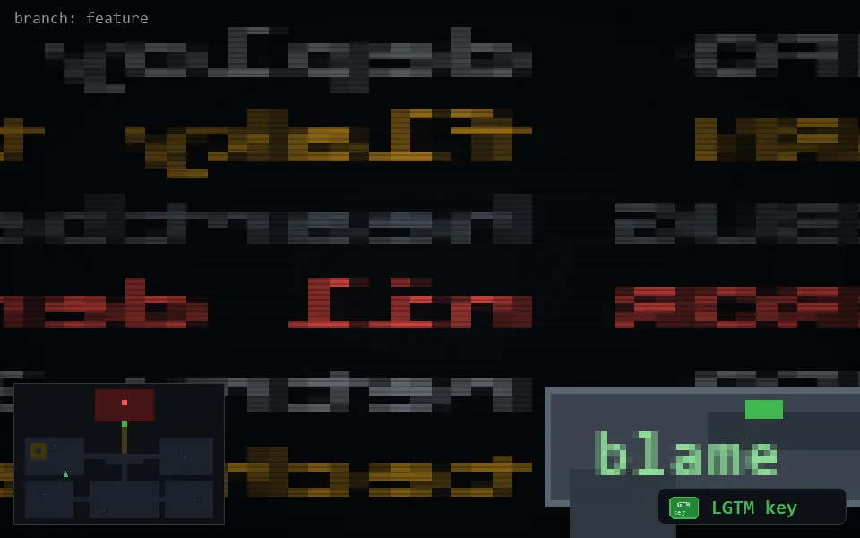

<!-- node:x09y16Sk -->
### `branch: feature` · 📍 (9, 16) · facing S · 🔑 THE KEY

|      |      |      |
|:----:|:----:|:----:|
|      | ⛔️ |      |
| [⬅️](x09y16Ek.md) | [💥](x09y16Skd.md) | [➡️](x09y16Wk.md) |
|      | [⬇️](x09y15Sk.md) |      |

[⌂ index](../README.md)
