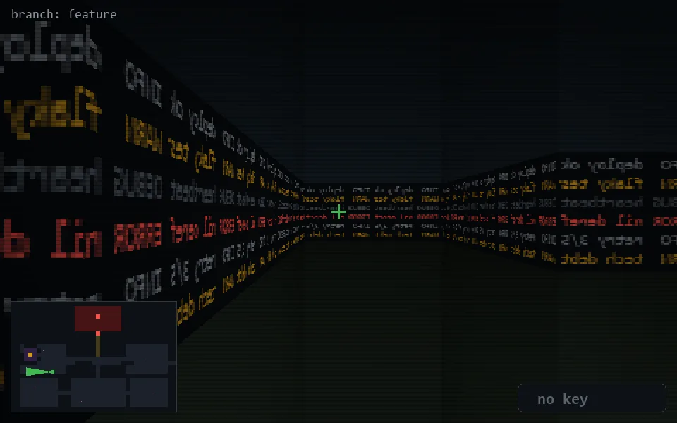

<!-- node:x09y16W -->
### `branch: feature` · 📍 (9, 16) · facing W · 🔑 —

|      |      |      |
|:----:|:----:|:----:|
|      | [⬆️](x08y16W.md) |      |
| [⬅️](x09y16S.md) | [💥](x09y16Wd.md) | [➡️](x09y16N.md) |
|      | [⬇️](x10y16W.md) |      |

[⌂ index](../README.md)
