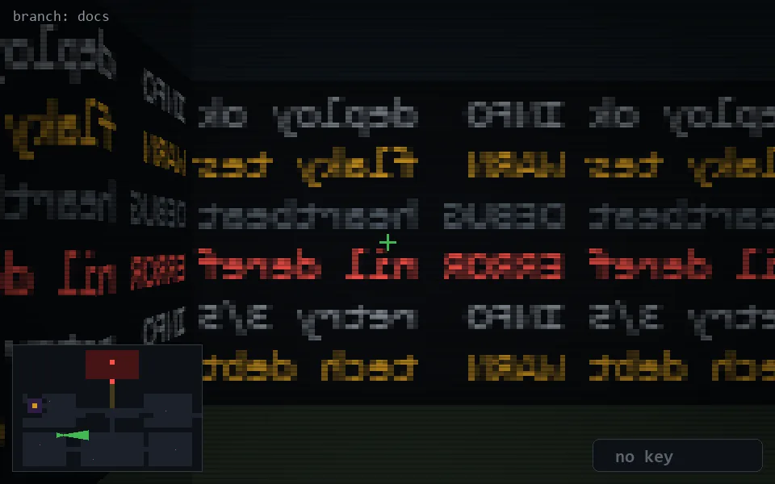

<!-- node:x09y18Ed -->
### `branch: docs` · 📍 (9, 18) · facing E · 🔑 — · ✖ bug deleted (it will be back)

|      |      |      |
|:----:|:----:|:----:|
|      | [⬆️](x10y18Ed.md) |      |
| [⬅️](x09y18Nd.md) | [💥](x09y18Ed.md) | [➡️](x09y18Sd.md) |
|      | [⬇️](x08y18Ed.md) |      |

[⌂ index](../README.md)
