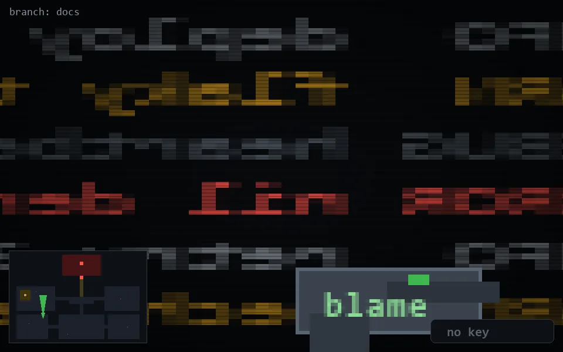

<!-- node:x09y18N -->
### `branch: docs` · 📍 (9, 18) · facing N · 🔑 —

|      |      |      |
|:----:|:----:|:----:|
|      | ⛔️ |      |
| [⬅️](x09y18W.md) | [💥](x09y18Nd.md) | [➡️](x09y18E.md) |
|      | [⬇️](x09y19N.md) |      |

[⌂ index](../README.md)
