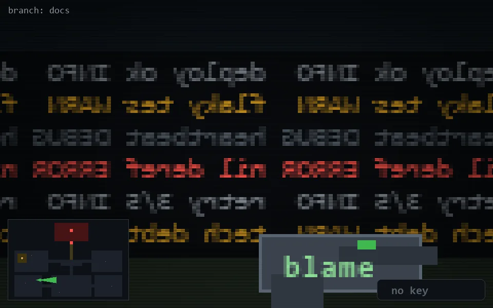

<!-- node:x09y19E -->
### `branch: docs` · 📍 (9, 19) · facing E · 🔑 —

|      |      |      |
|:----:|:----:|:----:|
|      | [⬆️](x10y19E.md) |      |
| [⬅️](x09y19N.md) | [💥](x09y19E.md) | [➡️](x09y19S.md) |
|      | [⬇️](x08y19E.md) |      |

[⌂ index](../README.md)
