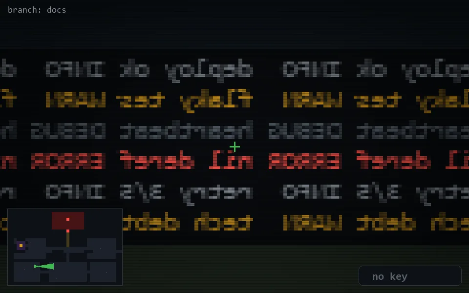

<!-- node:x09y19Ed -->
### `branch: docs` · 📍 (9, 19) · facing E · 🔑 — · ✖ bug deleted (it will be back)

|      |      |      |
|:----:|:----:|:----:|
|      | [⬆️](x10y19Ed.md) |      |
| [⬅️](x09y19Nd.md) | [💥](x09y19Ed.md) | [➡️](x09y19Sd.md) |
|      | [⬇️](x08y19Ed.md) |      |

[⌂ index](../README.md)
