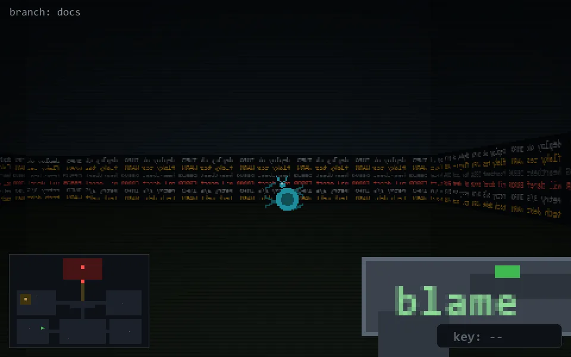

<!-- node:x09y20W -->
### `branch: docs` · 📍 (9, 20) · facing W · 🔑 —

|      |      |      |
|:----:|:----:|:----:|
|      | [⬆️](x08y20W.md) |      |
| [⬅️](x09y20S.md) | [💥](x09y20Wd.md) | [➡️](x09y20N.md) |
|      | [⬇️](x10y20W.md) |      |

[⌂ index](../README.md)
