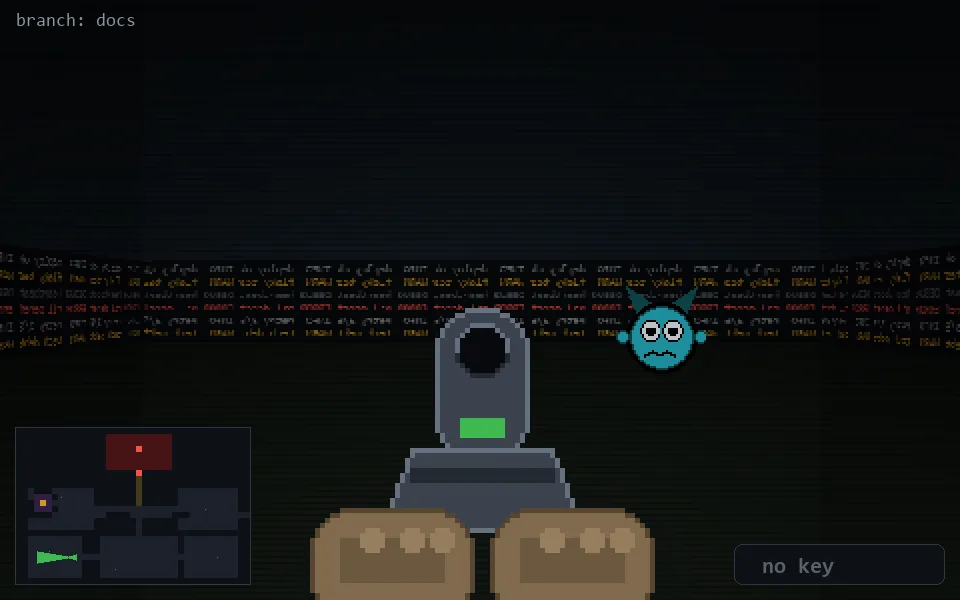

<!-- node:x09y21W -->
### `branch: docs` · 📍 (9, 21) · facing W · 🔑 —

|      |      |      |
|:----:|:----:|:----:|
|      | [⬆️](x08y21W.md) |      |
| [⬅️](x09y21S.md) | [💥](x09y21Wd.md) | [➡️](x09y21N.md) |
|      | [⬇️](x10y21W.md) |      |

[⌂ index](../README.md)
