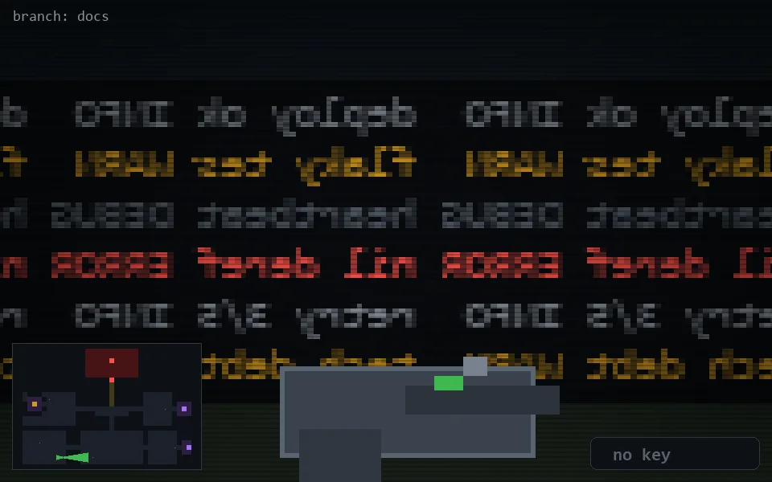

<!-- node:x09y23E -->
### `branch: docs` · 📍 (9, 23) · facing E · 🔑 —

|      |      |      |
|:----:|:----:|:----:|
|      | [⬆️](x10y23E.md) |      |
| [⬅️](x09y23N.md) | [💥](x09y23Ed.md) | [➡️](x09y23S.md) |
|      | [⬇️](x08y23E.md) |      |

[⌂ index](../README.md)
