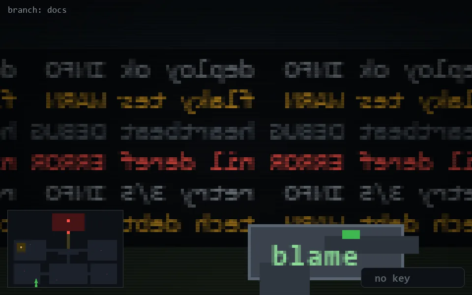

<!-- node:x09y23S -->
### `branch: docs` · 📍 (9, 23) · facing S · 🔑 —

|      |      |      |
|:----:|:----:|:----:|
|      | [⬆️](x09y24S.md) |      |
| [⬅️](x09y23E.md) | [💥](x09y23S.md) | [➡️](x09y23W.md) |
|      | [⬇️](x09y22S.md) |      |

[⌂ index](../README.md)
