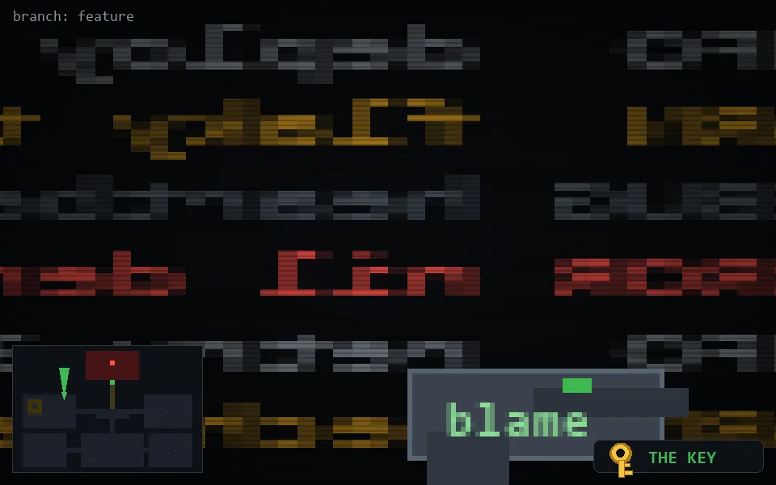

<!-- node:x10y10Nk -->
### `branch: feature` · 📍 (10, 10) · facing N · 🔑 THE KEY

|      |      |      |
|:----:|:----:|:----:|
|      | ⛔️ |      |
| [⬅️](x10y10Wk.md) | [💥](x10y10Nk.md) | [➡️](x10y10Ek.md) |
|      | [⬇️](x10y11Nk.md) |      |

[⌂ index](../README.md)
