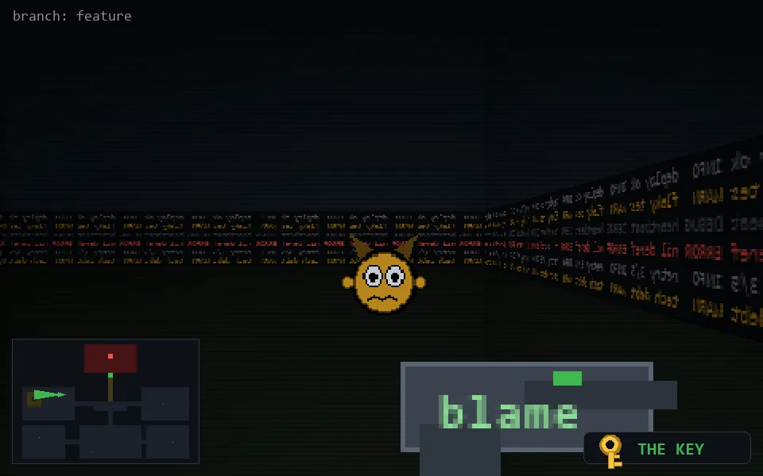

<!-- node:x10y11Wk -->
### `branch: feature` · 📍 (10, 11) · facing W · 🔑 LGTM

|      |      |      |
|:----:|:----:|:----:|
|      | [⬆️](x09y11Wk.md) |      |
| [⬅️](x10y11Sk.md) | [💥](x10y11Wk.md) | [➡️](x10y11Nk.md) |
|      | [⬇️](x11y11Wk.md) |      |

[⌂ index](../README.md)
