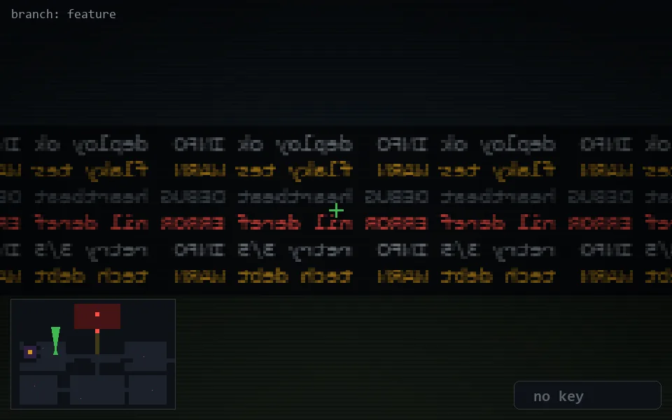

<!-- node:x10y12Nd -->
### `branch: feature` · 📍 (10, 12) · facing N · 🔑 — · ✖ bug deleted (it will be back)

|      |      |      |
|:----:|:----:|:----:|
|      | [⬆️](x10y11Nd.md) |      |
| [⬅️](x10y12Wd.md) | [💥](x10y12Nd.md) | [➡️](x10y12Ed.md) |
|      | [⬇️](x10y13Nd.md) |      |

[⌂ index](../README.md)
