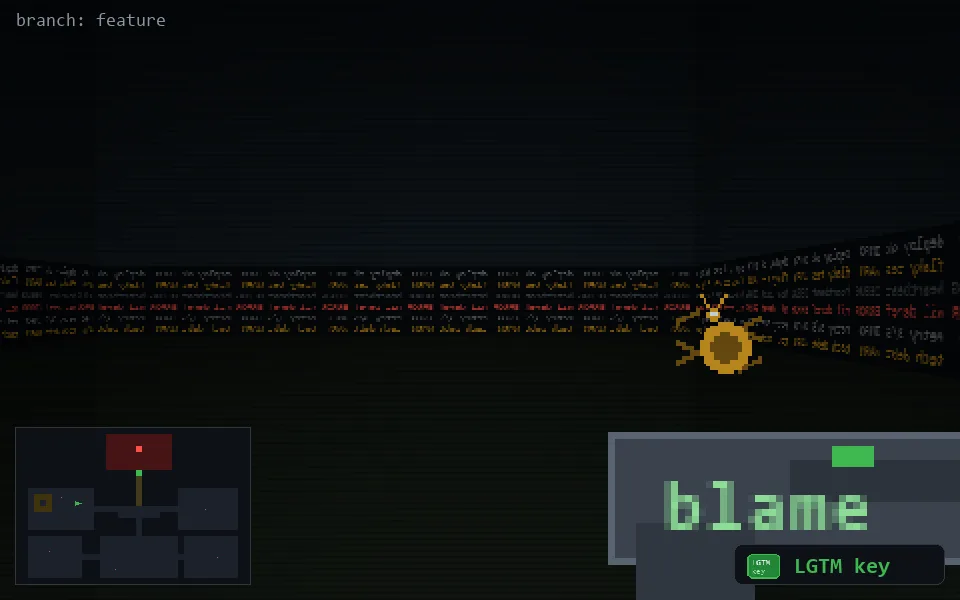

<!-- node:x10y12Wk -->
### `branch: feature` · 📍 (10, 12) · facing W · 🔑 THE KEY

|      |      |      |
|:----:|:----:|:----:|
|      | [⬆️](x09y12Wk.md) |      |
| [⬅️](x10y12Sk.md) | [💥](x10y12Wkd.md) | [➡️](x10y12Nk.md) |
|      | [⬇️](x11y12Wk.md) |      |

[⌂ index](../README.md)
