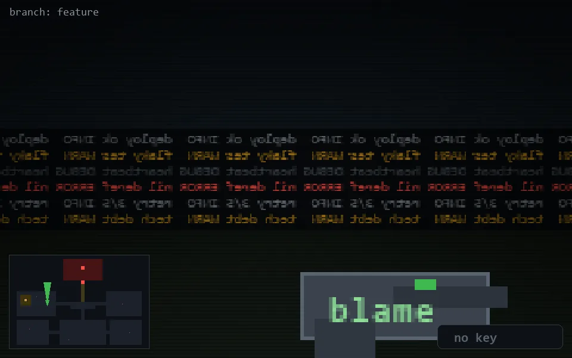

<!-- node:x10y13N -->
### `branch: feature` · 📍 (10, 13) · facing N · 🔑 —

|      |      |      |
|:----:|:----:|:----:|
|      | [⬆️](x10y12N.md) |      |
| [⬅️](x10y13W.md) | [💥](x10y13N.md) | [➡️](x10y13E.md) |
|      | [⬇️](x10y14N.md) |      |

[⌂ index](../README.md)
