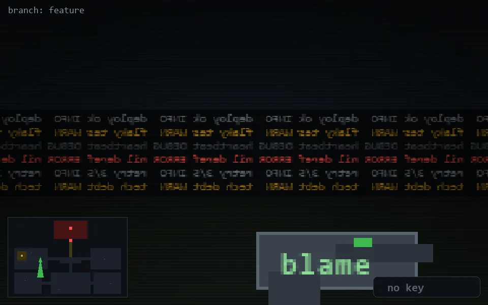

<!-- node:x10y13S -->
### `branch: feature` · 📍 (10, 13) · facing S · 🔑 —

|      |      |      |
|:----:|:----:|:----:|
|      | [⬆️](x10y14S.md) |      |
| [⬅️](x10y13E.md) | [💥](x10y13S.md) | [➡️](x10y13W.md) |
|      | [⬇️](x10y12S.md) |      |

[⌂ index](../README.md)
