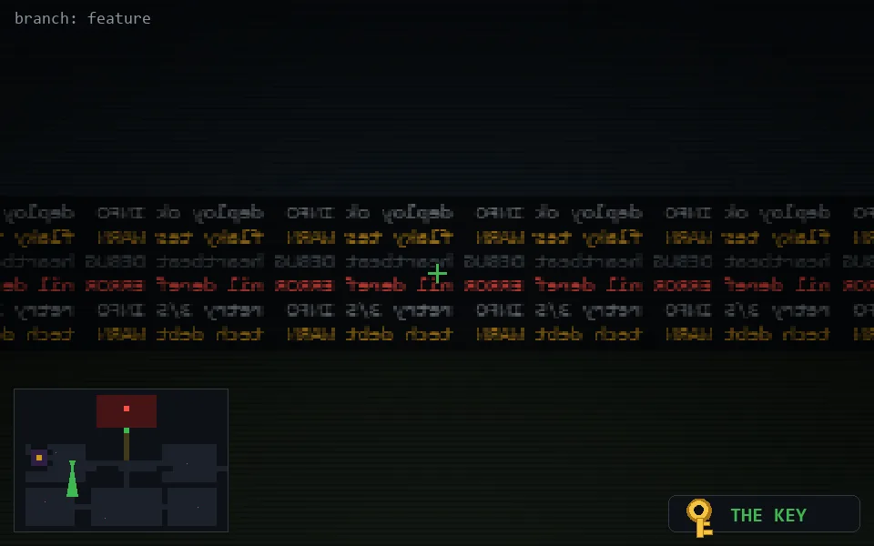

<!-- node:x10y13Sk -->
### `branch: feature` · 📍 (10, 13) · facing S · 🔑 THE KEY

|      |      |      |
|:----:|:----:|:----:|
|      | [⬆️](x10y14Sk.md) |      |
| [⬅️](x10y13Ek.md) | [💥](x10y13Sk.md) | [➡️](x10y13Wk.md) |
|      | [⬇️](x10y12Sk.md) |      |

[⌂ index](../README.md)
