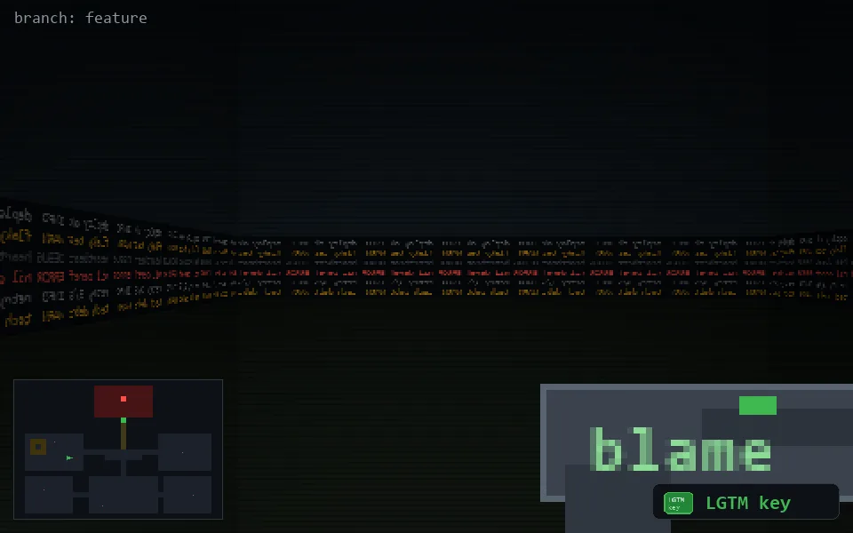

<!-- node:x10y14Wk -->
### `branch: feature` · 📍 (10, 14) · facing W · 🔑 THE KEY

|      |      |      |
|:----:|:----:|:----:|
|      | [⬆️](x09y14Wk.md) |      |
| [⬅️](x10y14Sk.md) | [💥](x10y14Wkd.md) | [➡️](x10y14Nk.md) |
|      | [⬇️](x11y14Wk.md) |      |

[⌂ index](../README.md)
