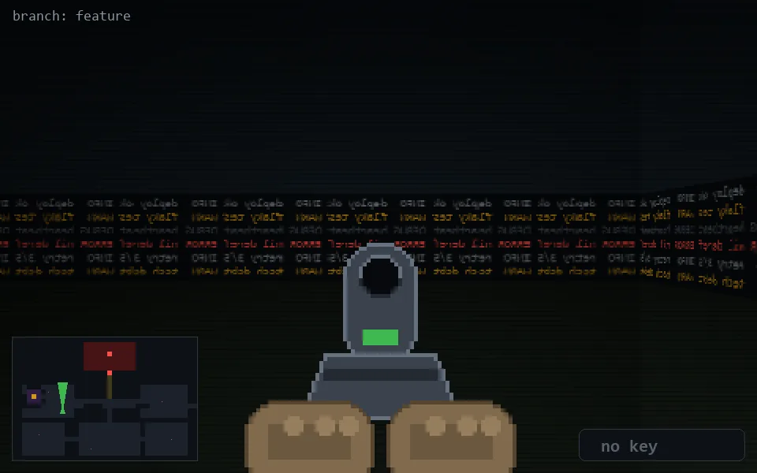

<!-- node:x10y15Nd -->
### `branch: feature` · 📍 (10, 15) · facing N · 🔑 — · ✖ bug deleted (it will be back)

|      |      |      |
|:----:|:----:|:----:|
|      | [⬆️](x10y14Nd.md) |      |
| [⬅️](x10y15Wd.md) | [💥](x10y15Nd.md) | [➡️](x10y15Ed.md) |
|      | [⬇️](x10y16Nd.md) |      |

[⌂ index](../README.md)
