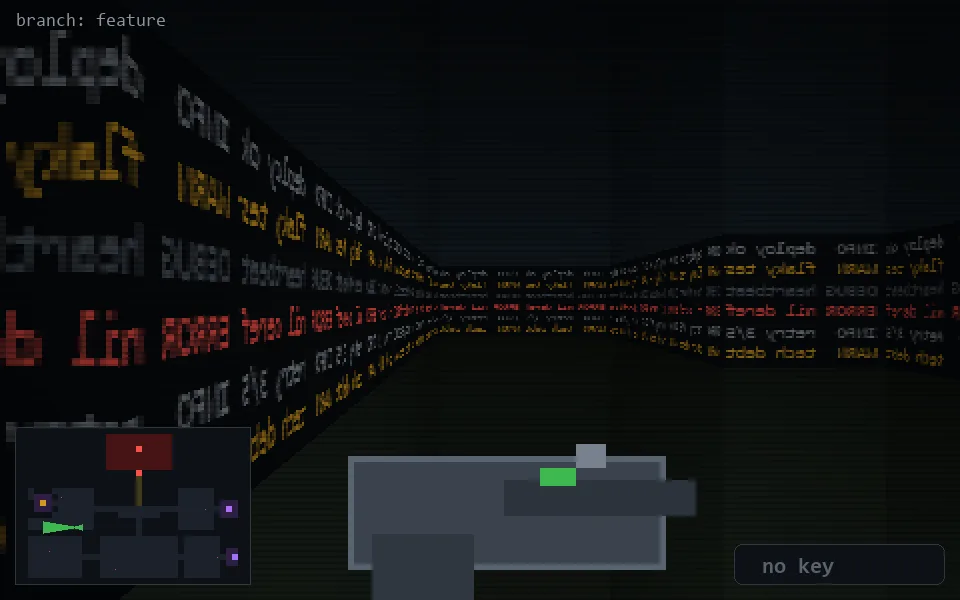

<!-- node:x10y16W -->
### `branch: feature` · 📍 (10, 16) · facing W · 🔑 —

|      |      |      |
|:----:|:----:|:----:|
|      | [⬆️](x09y16W.md) |      |
| [⬅️](x10y16S.md) | [💥](x10y16W.md) | [➡️](x10y16N.md) |
|      | [⬇️](x11y16W.md) |      |

[⌂ index](../README.md)
