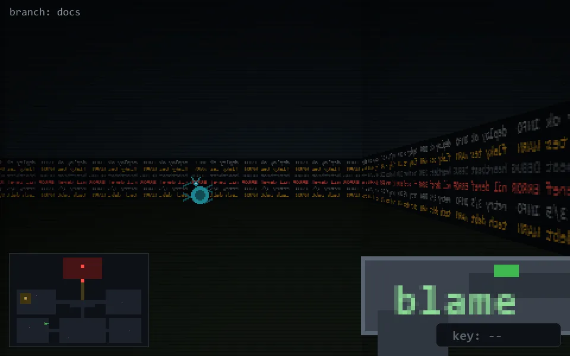

<!-- node:x10y19W -->
### `branch: docs` · 📍 (10, 19) · facing W · 🔑 —

|      |      |      |
|:----:|:----:|:----:|
|      | [⬆️](x09y19W.md) |      |
| [⬅️](x10y19S.md) | [💥](x10y19W.md) | [➡️](x10y19N.md) |
|      | ⛔️ |      |

[⌂ index](../README.md)
