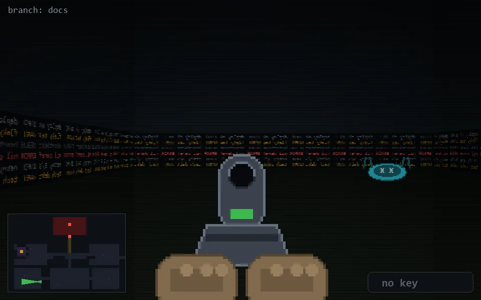

<!-- node:x10y22Wd -->
### `branch: docs` · 📍 (10, 22) · facing W · 🔑 — · ✖ bug deleted (it will be back)

|      |      |      |
|:----:|:----:|:----:|
|      | [⬆️](x09y22Wd.md) |      |
| [⬅️](x10y22Sd.md) | [💥](x10y22Wd.md) | [➡️](x10y22Nd.md) |
|      | ⛔️ |      |

[⌂ index](../README.md)
