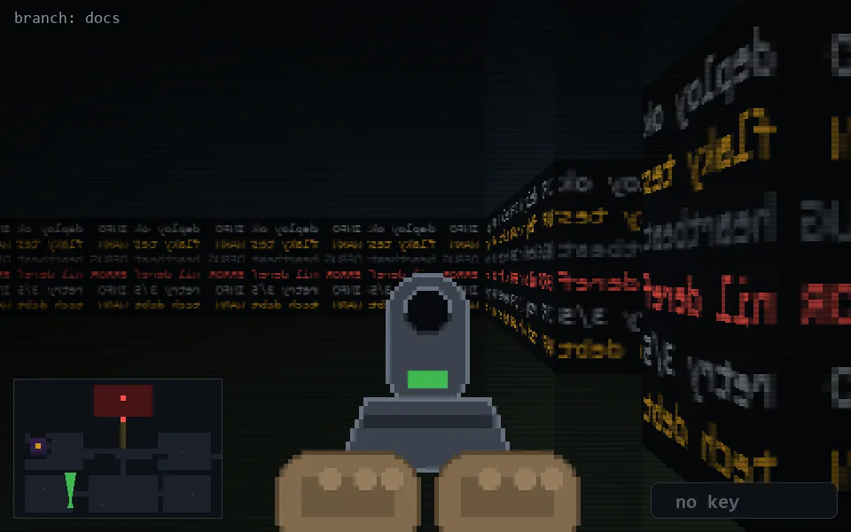

<!-- node:x10y23Nd -->
### `branch: docs` · 📍 (10, 23) · facing N · 🔑 — · ✖ bug deleted (it will be back)

|      |      |      |
|:----:|:----:|:----:|
|      | [⬆️](x10y22Nd.md) |      |
| [⬅️](x10y23Wd.md) | [💥](x10y23Nd.md) | [➡️](x10y23Ed.md) |
|      | [⬇️](x10y24Nd.md) |      |

[⌂ index](../README.md)
