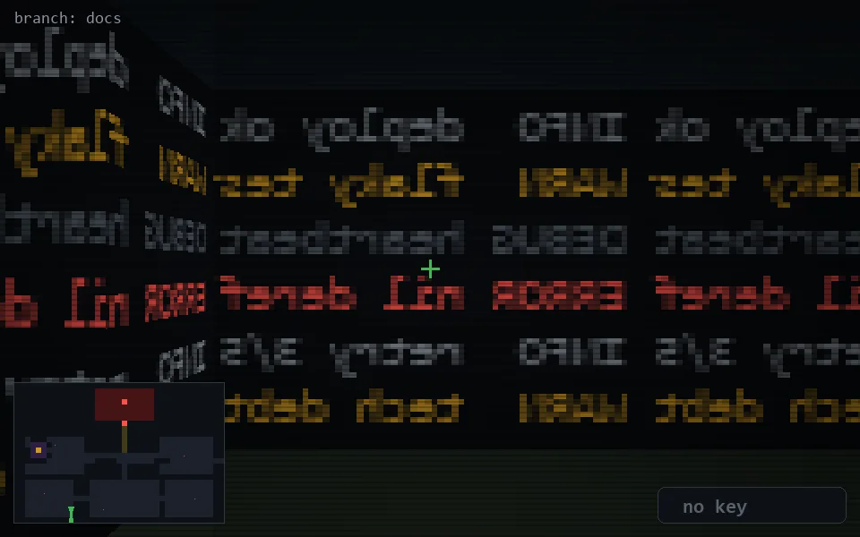

<!-- node:x10y23S -->
### `branch: docs` · 📍 (10, 23) · facing S · 🔑 —

|      |      |      |
|:----:|:----:|:----:|
|      | [⬆️](x10y24S.md) |      |
| [⬅️](x10y23E.md) | [💥](x10y23Sd.md) | [➡️](x10y23W.md) |
|      | [⬇️](x10y22S.md) |      |

[⌂ index](../README.md)
