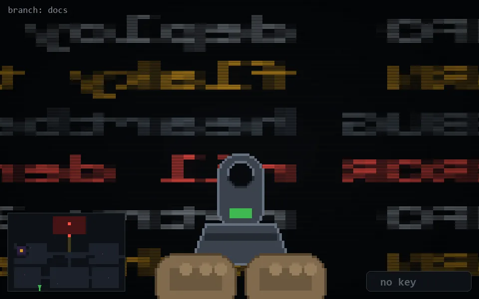

<!-- node:x10y24Sd -->
### `branch: docs` · 📍 (10, 24) · facing S · 🔑 — · ✖ bug deleted (it will be back)

|      |      |      |
|:----:|:----:|:----:|
|      | ⛔️ |      |
| [⬅️](x10y24Ed.md) | [💥](x10y24Sd.md) | [➡️](x10y24Wd.md) |
|      | [⬇️](x10y23Sd.md) |      |

[⌂ index](../README.md)
