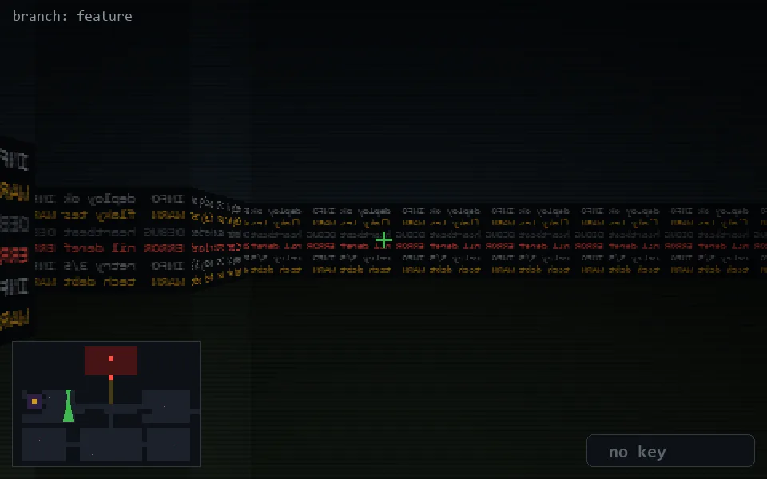

<!-- node:x11y10S -->
### `branch: feature` · 📍 (11, 10) · facing S · 🔑 —

|      |      |      |
|:----:|:----:|:----:|
|      | [⬆️](x11y11S.md) |      |
| [⬅️](x11y10E.md) | [💥](x11y10S.md) | [➡️](x11y10W.md) |
|      | ⛔️ |      |

[⌂ index](../README.md)
