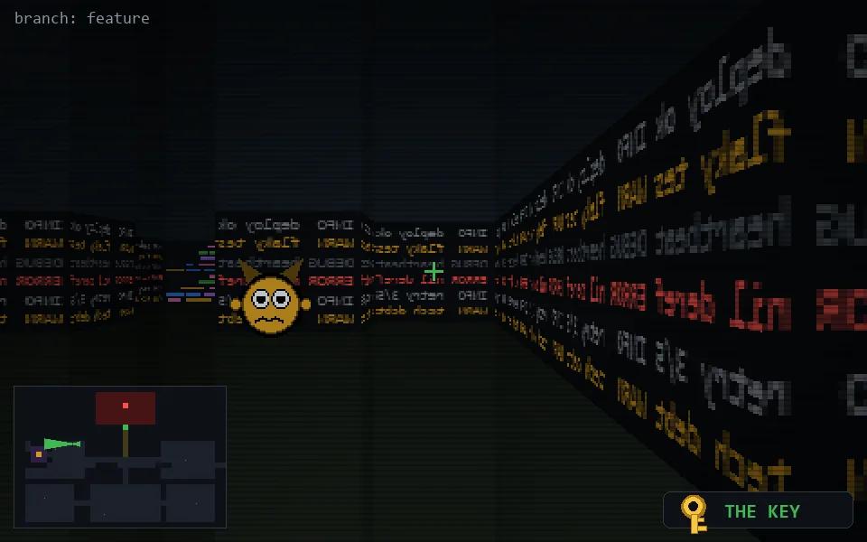

<!-- node:x11y10Wk -->
### `branch: feature` · 📍 (11, 10) · facing W · 🔑 THE KEY

|      |      |      |
|:----:|:----:|:----:|
|      | [⬆️](x10y10Wk.md) |      |
| [⬅️](x11y10Sk.md) | [💥](x11y10Wk.md) | [➡️](x11y10Nk.md) |
|      | [⬇️](x12y10Wk.md) |      |

[⌂ index](../README.md)
