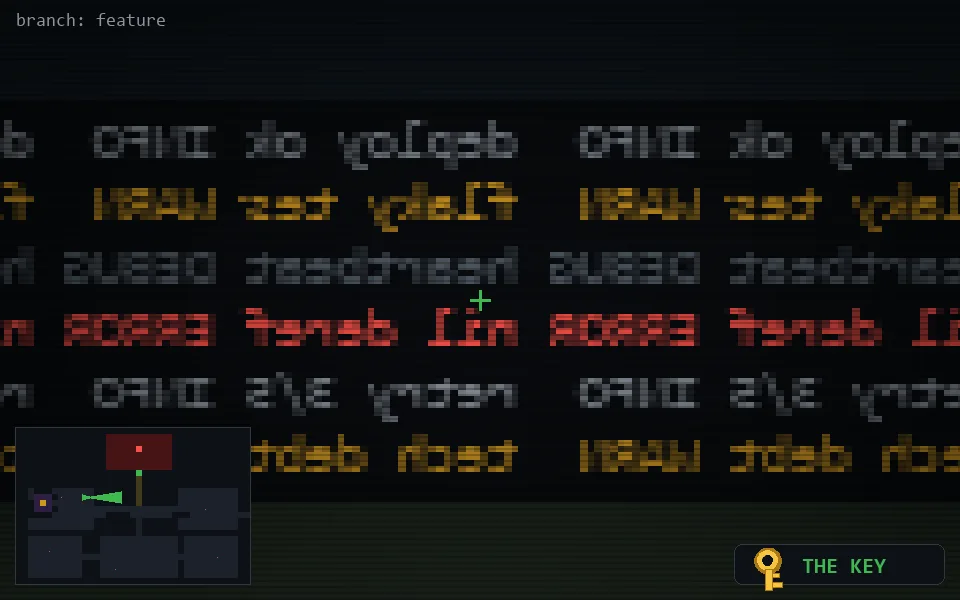

<!-- node:x11y11Ek -->
### `branch: feature` · 📍 (11, 11) · facing E · 🔑 LGTM

|      |      |      |
|:----:|:----:|:----:|
|      | [⬆️](x12y11Ek.md) |      |
| [⬅️](x11y11Nk.md) | [💥](x11y11Ek.md) | [➡️](x11y11Sk.md) |
|      | [⬇️](x10y11Ek.md) |      |

[⌂ index](../README.md)
