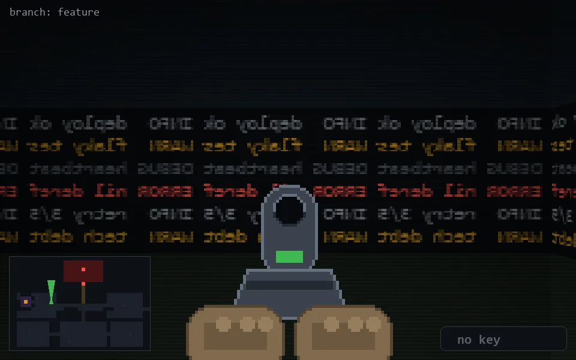

<!-- node:x11y12Nd -->
### `branch: feature` · 📍 (11, 12) · facing N · 🔑 — · ✖ bug deleted (it will be back)

|      |      |      |
|:----:|:----:|:----:|
|      | [⬆️](x11y11Nd.md) |      |
| [⬅️](x11y12Wd.md) | [💥](x11y12Nd.md) | [➡️](x11y12Ed.md) |
|      | [⬇️](x11y13Nd.md) |      |

[⌂ index](../README.md)
