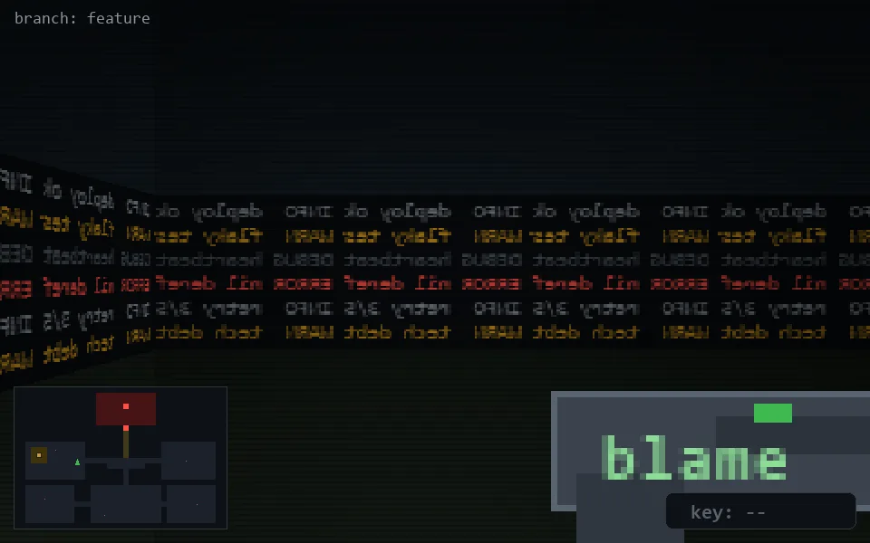

<!-- node:x11y13S -->
### `branch: feature` · 📍 (11, 13) · facing S · 🔑 —

|      |      |      |
|:----:|:----:|:----:|
|      | [⬆️](x11y14S.md) |      |
| [⬅️](x11y13E.md) | [💥](x11y13Sd.md) | [➡️](x11y13W.md) |
|      | [⬇️](x11y12S.md) |      |

[⌂ index](../README.md)
