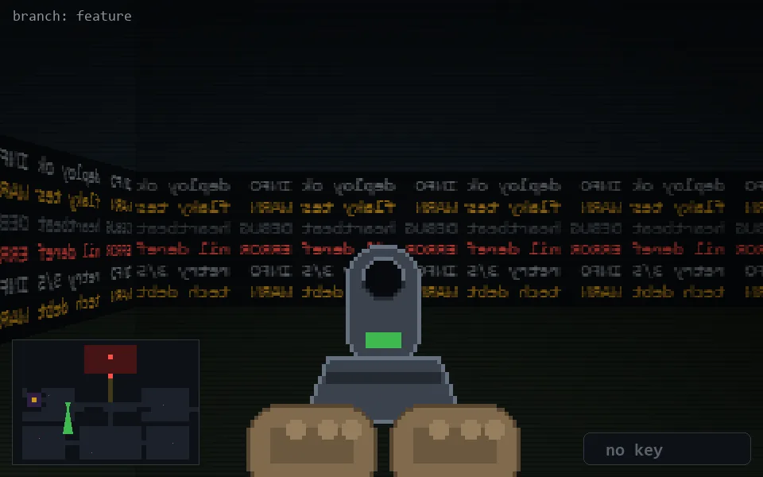

<!-- node:x11y13Sd -->
### `branch: feature` · 📍 (11, 13) · facing S · 🔑 — · ✖ bug deleted (it will be back)

|      |      |      |
|:----:|:----:|:----:|
|      | [⬆️](x11y14Sd.md) |      |
| [⬅️](x11y13Ed.md) | [💥](x11y13Sd.md) | [➡️](x11y13Wd.md) |
|      | [⬇️](x11y12Sd.md) |      |

[⌂ index](../README.md)
