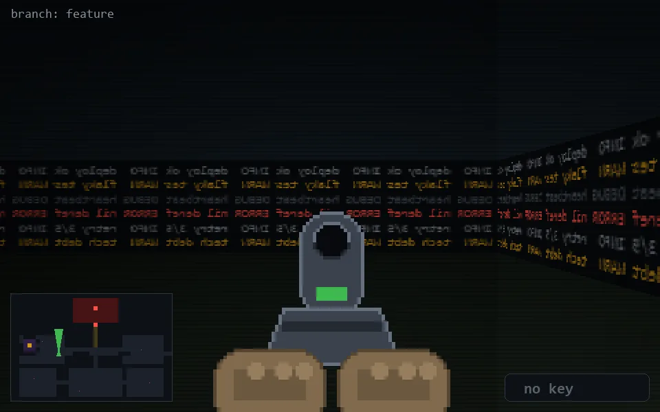

<!-- node:x11y14Nd -->
### `branch: feature` · 📍 (11, 14) · facing N · 🔑 — · ✖ bug deleted (it will be back)

|      |      |      |
|:----:|:----:|:----:|
|      | [⬆️](x11y13Nd.md) |      |
| [⬅️](x11y14Wd.md) | [💥](x11y14Nd.md) | [➡️](x11y14Ed.md) |
|      | [⬇️](x11y15Nd.md) |      |

[⌂ index](../README.md)
