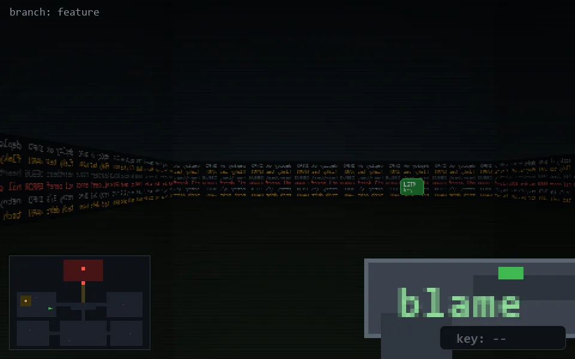

<!-- node:x11y14W -->
### `branch: feature` · 📍 (11, 14) · facing W · 🔑 —

|      |      |      |
|:----:|:----:|:----:|
|      | [⬆️](x10y14W.md) |      |
| [⬅️](x11y14S.md) | [💥](x11y14Wd.md) | [➡️](x11y14N.md) |
|      | [⬇️](x12y14W.md) |      |

[⌂ index](../README.md)
