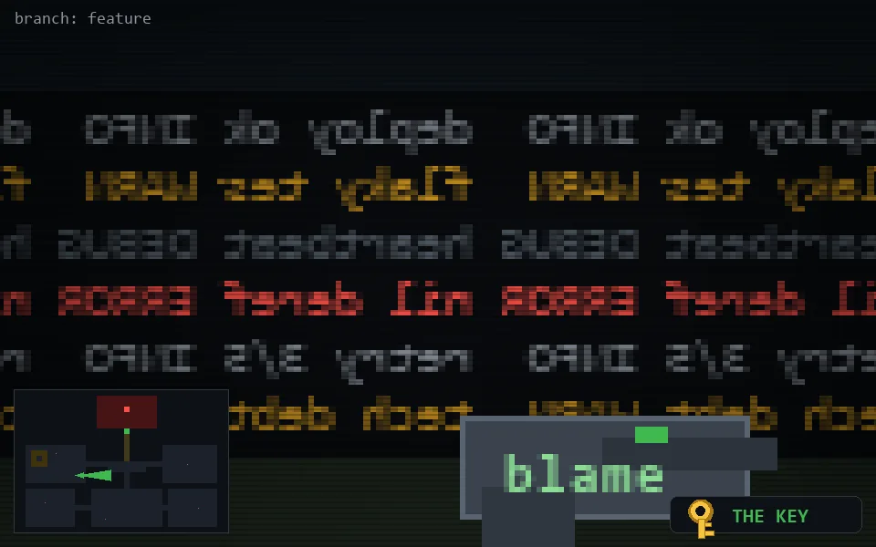

<!-- node:x11y15Ek -->
### `branch: feature` · 📍 (11, 15) · facing E · 🔑 LGTM

|      |      |      |
|:----:|:----:|:----:|
|      | [⬆️](x12y15Ek.md) |      |
| [⬅️](x11y15Nk.md) | [💥](x11y15Ek.md) | [➡️](x11y15Sk.md) |
|      | [⬇️](x10y15Ek.md) |      |

[⌂ index](../README.md)
