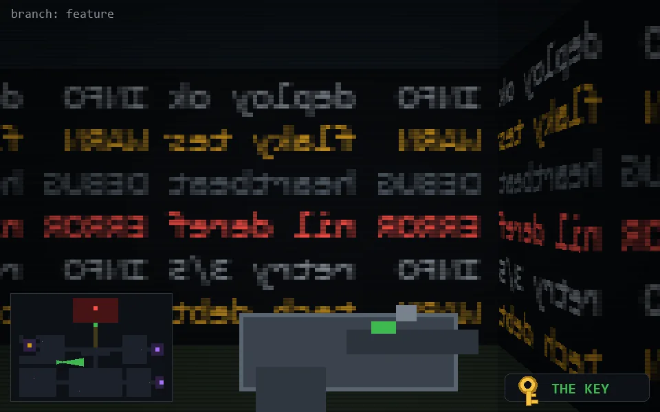

<!-- node:x11y16Ek -->
### `branch: feature` · 📍 (11, 16) · facing E · 🔑 THE KEY

|      |      |      |
|:----:|:----:|:----:|
|      | [⬆️](x12y16Ek.md) |      |
| [⬅️](x11y16Nk.md) | [💥](x11y16Ek.md) | [➡️](x11y16Sk.md) |
|      | [⬇️](x10y16Ek.md) |      |

[⌂ index](../README.md)
