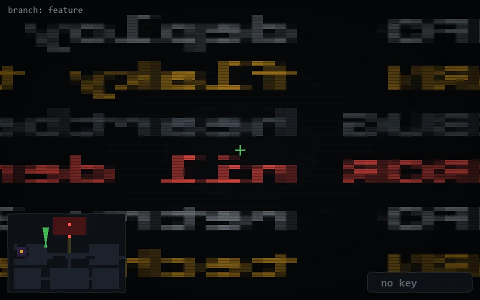

<!-- node:x12y10Nd -->
### `branch: feature` · 📍 (12, 10) · facing N · 🔑 — · ✖ bug deleted (it will be back)

|      |      |      |
|:----:|:----:|:----:|
|      | ⛔️ |      |
| [⬅️](x12y10Wd.md) | [💥](x12y10Nd.md) | [➡️](x12y10Ed.md) |
|      | [⬇️](x12y11Nd.md) |      |

[⌂ index](../README.md)
