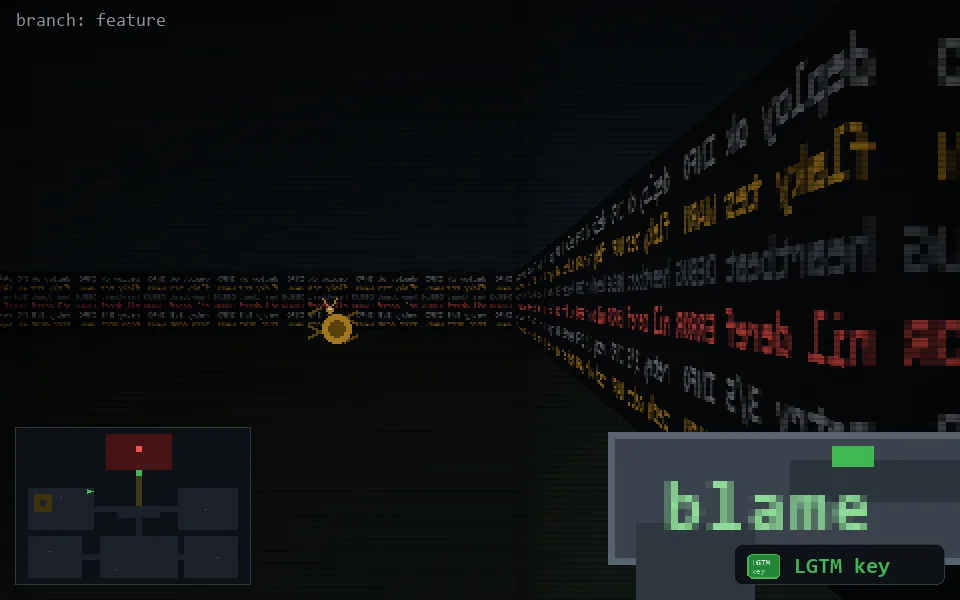

<!-- node:x12y10Wk -->
### `branch: feature` · 📍 (12, 10) · facing W · 🔑 LGTM

|      |      |      |
|:----:|:----:|:----:|
|      | [⬆️](x11y10Wk.md) |      |
| [⬅️](x12y10Sk.md) | [💥](x12y10Wk.md) | [➡️](x12y10Nk.md) |
|      | ⛔️ |      |

[⌂ index](../README.md)
