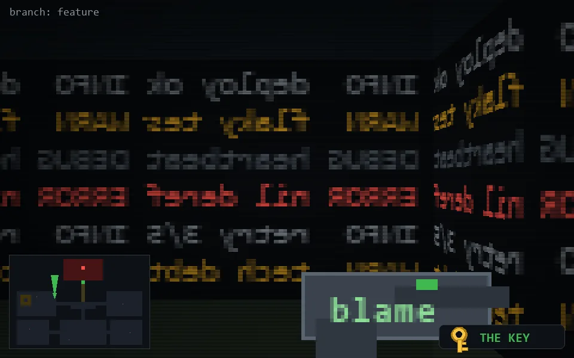

<!-- node:x12y11Nk -->
### `branch: feature` · 📍 (12, 11) · facing N · 🔑 THE KEY

|      |      |      |
|:----:|:----:|:----:|
|      | [⬆️](x12y10Nk.md) |      |
| [⬅️](x12y11Wk.md) | [💥](x12y11Nk.md) | [➡️](x12y11Ek.md) |
|      | [⬇️](x12y12Nk.md) |      |

[⌂ index](../README.md)
